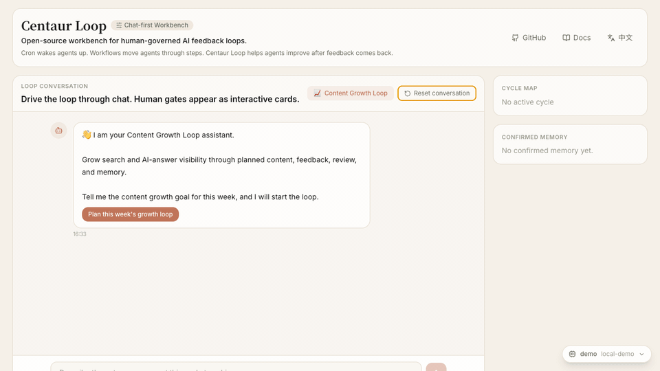

# Centaur Loop

[](./LICENSE)
[](https://www.typescriptlang.org/)
[](https://react.dev/)
[](https://github.com/finewood2008/centaur-loop/actions/workflows/ci.yml)
[](https://github.com/finewood2008/centaur-loop/actions/workflows/pages.yml)

English | [简体中文](./README.zh-CN.md) | [Website](https://www.centaurloop.com) | [Technical Design](./CENTAUR_LOOP_TECHNICAL_DOC_EN.md)

**The open-source workbench for human-governed AI feedback loops.**

Centaur Loop helps teams run AI agents as accountable operating cycles. Agents can plan and execute, but humans keep judgment authority at explicit gates; real-world feedback becomes reviewed memory for the next run.

```text
Plan -> Approve -> Execute -> Review -> Publish -> Feedback -> Reflect -> Remember -> Next Cycle
```

> Cron wakes agents up. Workflows move agents through steps. Centaur Loop helps agents improve after feedback comes back.

## Demo



This demo shows the current MVP running a full content growth loop: AI planning, human gates, draft review, manual publish marking, sample feedback, retrospective review, memory confirmation, and a completed cycle with confirmed memory ready for the next run.

## Why It Matters

Most agent systems optimize the moment before output: prompting, tool use, scheduling, orchestration. The hard product problem often starts after output leaves the chat window: Was it approved? Was it published? Did it work? What should the agent remember next time?

Centaur Loop makes that whole cycle the product surface: stage state, human gates, feedback capture, retrospective review, memory candidates, and next-cycle suggestions.

## What It Is

- A chat-first React workbench for driving an AI feedback loop end to end.
- A TypeScript state machine for explicit loop stages and human checkpoints.
- A local runtime connector layer for OpenAI-compatible models, Ollama, LM Studio, vLLM, and llama.cpp.
- A demoable content growth loop that proves planning, draft review, publishing, feedback, review, memory, and improvement.
- A design reference for building human-governed AI products.

## What It Is Not

- Not a cron scheduler.
- Not a generic workflow canvas.
- Not a publishing bot.
- Not a replacement for LangGraph, Temporal, Inngest, n8n, Mastra, or agent frameworks.

Existing runtimes execute tasks. Centaur Loop governs the feedback loop around those tasks.

## MVP Experience

The current MVP focuses on one scenario: **Content Growth Loop**.

1. Start with a weekly growth goal.
2. AI proposes a structured plan.
3. Human approves or changes the plan.
4. AI generates reviewable drafts.
5. Human approves drafts and marks publishing.
6. Human submits outcome feedback.
7. AI reviews results and proposes memory candidates.
8. Human confirms which lessons become memory.
9. The next cycle starts with prior memory in context.

## Core Lifecycle

```text
planning
  -> awaiting_plan_review
  -> generating
  -> awaiting_review
  -> awaiting_publish
  -> awaiting_feedback
  -> reviewing_auto
  -> awaiting_memory
  -> cycle_complete
```

## Architecture

| Layer | Role |
| --- | --- |
| `src/core/loopEngine.ts` | Explicit state machine that advances cycles and stops at human gates. |
| `src/core/loopPlanner.ts` | Turns goals, memory, business context, and tools into structured plans. |
| `src/core/loopExecutor.ts` | Generates reviewable drafts and keeps failures inside the cycle record. |
| `src/core/loopReviewer.ts` | Converts feedback into retrospectives, lessons, and next-cycle suggestions. |
| `src/protocol/loopChat.ts` | Maps runtime state to chat messages, cards, and user actions. |
| `src/adapters/*` | Runtime, tool, feedback, and memory boundaries. |
| `src/ui/*` | Chat-first workbench, embedded action cards, runtime dropdown, feedback and memory surfaces. |

## Runtime Connectors

Centaur Loop runs without an API key through the deterministic demo runtime. For real models, the browser only calls the local Vite proxy; API keys never enter the frontend bundle.

Supported runtime paths today:

- `local-demo`: built-in deterministic demo runtime.
- `openai-compatible-env`: any OpenAI-compatible `/chat/completions` endpoint configured through environment variables.
- `ollama-local`: detected through `127.0.0.1:11434/api/tags` and called through `/api/chat`.
- `lm-studio-local`: detected through `127.0.0.1:1234/v1/models`.
- `vllm-local`: detected through `127.0.0.1:8000/v1/models`.
- `llamacpp-local`: detected through `127.0.0.1:8080/v1/models`.

Planned adapter examples are shown for LangGraph, Temporal, and n8n-style approval flows.

## Quick Start

```bash
npm install
npm run dev
```

Open the Vite URL printed in your terminal. The app works immediately with the demo runtime.

## Real Model Setup

Create `.env.local`:

```bash
cp .env.example .env.local
```

Configure an OpenAI-compatible endpoint:

```bash
CENTAUR_MODEL_BASE_URL=https://api.openai.com/v1
CENTAUR_MODEL_API_KEY=your_key_here
CENTAUR_MODEL_NAME=gpt-4o-mini
```

Then restart the dev server and select the runtime from the floating runtime menu.

## Development

```bash
npm run typecheck
npm run build
```

## Roadmap

- Extract `@centaur-loop/core` from the demo workbench.
- Add durable storage, notifier, model, and memory adapters.
- Add regeneration and revision flows for rejected drafts.
- Add integration examples for LangGraph, Mastra, Inngest, Temporal, and n8n-style approvals.
- Improve durable execution, idempotency, retry behavior, and checkpoint recovery.
- Add richer semantic memory retrieval beyond the current local prototype.

## Project Status

Centaur Loop is early. The current codebase is a working MVP and product design reference, not a stable library API yet. The goal is to make the feedback layer around agent work concrete, inspectable, and easy to extend.

## Contributing

Focused issues and small PRs are welcome. See [CONTRIBUTING.md](./CONTRIBUTING.md) before opening larger design changes.

## License

MIT
